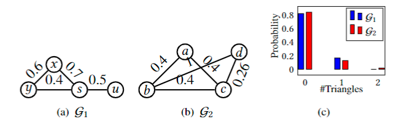

Codes for the VLDB2024 submission titled `Estimate and Reduce Uncertainty of Network Measurements`

-----------
<h> Requirements: </h>
 * Python 3.8
 * networkx
 * matplotlib
 * scipy
 * pandas
 * pptree
 * heapdict
 * pytorch 1.12

<h> Datasets: </h>

Datasets and Queries can be downloaded from here: https://drive.google.com/file/d/12sNW29Dpo68vqvIw7uJl16Byn0z_whIw/view?usp=sharing 

<h> Experiments: </h>
1. Measuring uncertainty:
   - python measure_main.py -d [DATASET] -a [ALGORITHM] -pr [PROPERTY] -q [QUERYFILE] -N [N] -T [T]
  
2. Reducing uncertainty with U1 update:
   - python reduce_main.py -d [DATASET] -a [ALGORITHM] -k [BUDGET] -ea [UNCERTAINTY_ESTIMATE_METHOD] -pr [PROPERTY] -q [QUERYFILE] -dh [HOP_DISTANCE_FOR_dhop_REACH]
  
3. Reducing uncertainty with U2 update (Adaptive):
   -  python reduce_main_crowd.py -d [DATASET] -a [ALGORITHM] -k [BUDGET] -ea [UNCERTAINTY_ESTIMATE_METHOD] -pr [PROPERTY] -q [QUERYFILE] -dh [HOP_DISTANCE_FOR_dhop_REACH] -cr [GROUNDTRUTH_CLEAN_FILE] -u c2
4. Reducing uncertainty with U2 update (Non-adaptive):
   - python reduce_main_crowd.py -d [DATASET] -a [ALGORITHM] -k [BUDGET] -ea [UNCERTAINTY_ESTIMATE_METHOD] -pr [PROPERTY] -q [QUERYFILE] -dh [HOP_DISTANCE_FOR_dhop_REACH] -cr [GROUNDTRUTH_CLEAN_FILE]

<h> Node classification application: </h>
Please check the notebooks under `casestudy/`

Running RelComp to generate ProbTree Subgraphs (needed for ProbTree-MC, ProbTree-MC+BFS and ProbTree-RSS):
--------

<h> Requirements </h>

- CMAKE 3.0
- gcc-8 g++-8
- To run with g++-7: Uncomment lines 1-2 in CMakeLists.txt
  - `set(CMAKE_C_COMPILER "gcc-7")`
  - `set(CMAKE_CXX_COMPILER "g++-7")`
- Boost (minimum 1.54)

<h> Compile </h>

- `mkdir build`
- `cd build`
- `cmake ..`
- `make`

<h> Run for Reachability query </h>

- Unweighted graph:
  - `./RelComp -i test_graph.txt -l [full path of the directory containing test_graph.txt] -d decomp/ -s test_sourcetarget.txt -m 5 -w 0`
<!-- - Weighted graph:
  - `./RelComp -i test_wgraph.txt -l [full path of the directory containing test_wgraph.txt] -d decomp/ -s test_sourcetarget.txt -m 5 -w 1` -->
